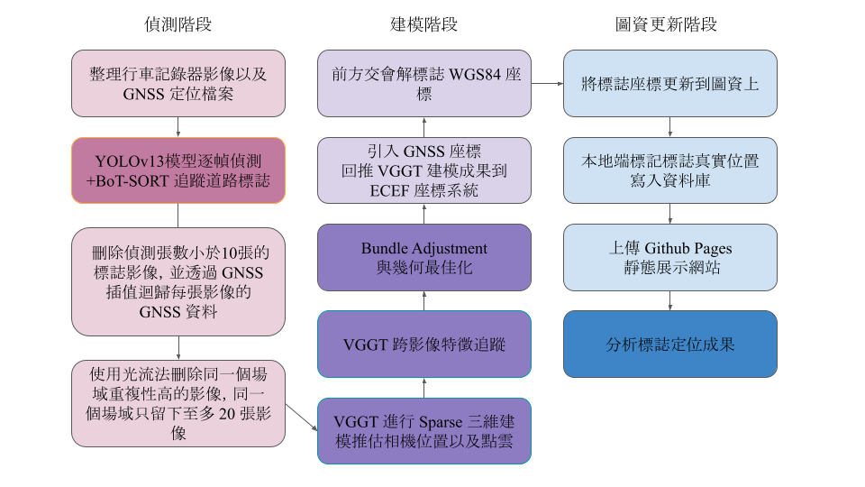

# 基於 YOLOv13 與 VGGT 之道路標誌辨識、三維定位與自動化圖資建置研究

## Demo Videos

### Detection Demo
[▶ Watch `Detection_Demo.mp4`](./Demo_Video/Detection_Demo.mp4)

### System Demo
[▶ Watch `System_Demo.mp4`](./Demo_Video/System_Demo.mp4)

---

## System Workflow



---

## Reports

- **Refined Project Report:**  
  https://docs.google.com/document/d/1zI8z4V9iFjIFXypButmdUuZE3iyr54Gn/edit?usp=sharing&ouid=117955251427297857157&rtpof=true&sd=true

- **Full Project Report:**  
  https://docs.google.com/document/d/1JDLs_wOmxxOEWwdIgnsEIZhr3Kaqqhct/edit?usp=sharing&ouid=117955251427297857157&rtpof=true&sd=true

---

## Project Overview

This project develops an end-to-end pipeline for **road-sign detection, multi-view 3D reconstruction, geolocation, and automated map-data construction** from forward-facing road video and GNSS/NMEA data.

The system first detects and tracks road signs using **YOLOv13** and **BoT-SORT**, then associates each sign track with synchronized GNSS observations. Redundant frames are removed with optical-flow-based filtering, and representative multi-view images are selected for 3D reconstruction. **VGGT** is used to estimate scene geometry and camera poses, followed by **COLMAP Bundle Adjustment** to refine the reconstruction. The local 3D model is aligned to the **ECEF** coordinate system using GNSS information, and each road-sign position is estimated through **multi-view ray intersection / forward intersection**. The final WGS84 coordinates and sign information are exported for visualization on a web-based map.

### Main Technologies

- **YOLOv13** — road-sign detection
- **BoT-SORT** — multi-object tracking and cross-frame sign association
- **GNSS / NMEA** — frame-level geographic reference
- **Optical Flow** — redundant-frame filtering
- **VGGT** — multi-view 3D reconstruction and camera-pose estimation
- **COLMAP / Bundle Adjustment** — reconstruction refinement and GNSS alignment
- **Multi-view Forward Intersection** — road-sign 3D position estimation
- **WGS84 / ECEF** — geographic coordinate transformation
- **OpenStreetMap / GitHub Pages** — result visualization and map-data presentation

### Processing Pipeline

```text
Road Video + NMEA/GNSS
        │
        ▼
Video/NMEA Preprocessing
        │
        ▼
YOLOv13 Detection + BoT-SORT Tracking
        │
        ▼
GNSS Synchronization and Interpolation
        │
        ▼
Track Filtering + Optical-Flow Redundancy Removal
        │
        ▼
Representative Multi-view Image Selection
        │
        ▼
VGGT 3D Reconstruction
        │
        ▼
COLMAP Bundle Adjustment
        │
        ▼
GNSS Alignment to ECEF
        │
        ▼
Multi-view Ray / Forward Intersection
        │
        ▼
WGS84 Road-sign Coordinates
        │
        ▼
Result Database + Web Map Visualization
```

---

## Repository Structure

```text
GM_Proj/
├── Demo_Video/
│   ├── Detection_Demo.mp4
│   └── System_Demo.mp4
├── README_Assets/
│   └── System_Flow.png
├── Models/
│   ├── best.pt
│   └── botsort.yaml
├── Original_Videos/
├── Processed_Videos/
├── utils/
│   ├── video_process/
│   │   ├── video_combine.py
│   │   └── nmea2csv.py
│   ├── object_process/
│   │   ├── object_detection.py
│   │   ├── object_getlatlon.py
│   │   ├── object_clean.py
│   │   ├── object_upload.py
│   │   └── prepare_vggt.py
│   ├── vggt/
│   │   └── bash.sh
│   └── upload_process/
│       ├── combine_data.py
│       └── write_data.py
├── requirement.txt
└── README.md
```

All project scripts use relative paths such as `./Original_Videos/`, `./Processed_Videos/`, and `./Models/`. Run all commands from the **repository root** unless these paths are intentionally modified.

---

## Code Functions

| Script | Function |
| --- | --- |
| `utils/video_process/video_combine.py` | Groups temporally continuous front-camera video and NMEA segments into individual trips, merges MP4 files with FFmpeg, and concatenates NMEA records. |
| `utils/video_process/nmea2csv.py` | Parses merged NMEA files, converts timestamps to UTC+8, converts NMEA coordinates to decimal degrees, and exports trip-level GNSS CSV files. |
| `utils/object_process/object_detection.py` | Runs YOLOv13 road-sign detection and BoT-SORT tracking, stores per-track sign images, generates `detect.csv` / `detect.mp4`, and associates GNSS observations with video frames. |
| `utils/object_process/object_getlatlon.py` | Marks original GNSS observations and linearly interpolates longitude/latitude between valid GNSS anchor frames. |
| `utils/object_process/object_clean.py` | Removes highly similar sign images using FAST features and Lucas-Kanade optical flow; tracks with insufficient retained observations are discarded. |
| `utils/object_process/object_upload.py` | Limits each retained sign track to at most 20 representative images while preserving the first and last frames and uniformly sampling intermediate frames. |
| `utils/object_process/prepare_vggt.py` | Converts each retained sign track into the directory and metadata format required by VGGT. |
| `utils/vggt/bash.sh` | Runs VGGT reconstruction, COLMAP Bundle Adjustment, GNSS alignment, multi-view ray intersection, and per-sign geolocation/error export. |
| `utils/upload_process/combine_data.py` | Combines completed sign-scene results, adds trip/sign metadata, and copies one representative image per sign. |
| `utils/upload_process/write_data.py` | Converts the combined result CSV into `data.json` and copies representative images into the web-data directory. |

---

## Environment Setup

### Platform

The current workflow is intended for **Linux** because it uses Bash, FFmpeg/FFprobe, COLMAP, and CUDA-enabled deep-learning tools.

A CUDA-capable NVIDIA GPU is strongly recommended for YOLOv13 and VGGT.

### Python Environment

The project was developed with **Python 3.11**.

```bash
conda create -n gm_proj python=3.11 -y
conda activate gm_proj
python -m pip install --upgrade pip
pip install -r requirement.txt
```

### System Dependencies

On Ubuntu/Debian:

```bash
sudo apt update
sudo apt install -y git ffmpeg colmap
```

Verify the required commands:

```bash
git --version
ffmpeg -version
ffprobe -version
colmap -h
```

> PyTorch/CUDA compatibility depends on the installed NVIDIA driver and CUDA environment. If the PyTorch build in `requirement.txt` does not match the local CUDA setup, install a compatible PyTorch build before running GPU stages.

---

## Model Files

Place the trained detector and tracker configuration under:

```text
Models/
├── best.pt
└── botsort.yaml
```

- `best.pt`: trained YOLOv13 road-sign detection weights
- `botsort.yaml`: BoT-SORT tracker configuration

The detection script reads these files from:

```text
./Models/best.pt
./Models/botsort.yaml
```

---

## Input Data

Place the original forward-camera video and NMEA files under:

```text
Original_Videos/
└── Normal/
    ├── F/
    │   ├── FILE250101-120000F.mp4
    │   ├── FILE250101-120300F.mp4
    │   └── ...
    └── NMEA/
        ├── FILE250101-120000F.nmea
        ├── FILE250101-120300F.nmea
        └── ...
```

Expected filename format:

```text
<event><YYMMDD>-<HHMMSS><camera>.<extension>
```

For the current pipeline:

```text
FILE250101-120000F.mp4
FILE250101-120000F.nmea
```

Use `FILE` as the event prefix and `F` as the front-camera suffix because downstream scripts preserve the `FILEYYMMDD-HHMMSS` trip naming convention.

Video segments separated by no more than 30 seconds are grouped into the same trip by `video_combine.py`.

---

## Execution Steps

Run the following commands from the **repository root**.

### 1. Combine video and NMEA segments

```bash
python utils/video_process/video_combine.py
```

Example output:

```text
Processed_Videos/
└── FILE250101-120000/
    ├── FILE250101-120000.mp4
    └── FILE250101-120000.NMEA
```

### 2. Convert NMEA to GNSS CSV

```bash
python utils/video_process/nmea2csv.py
```

A trip-level GNSS CSV is generated beside the merged NMEA file.

### 3. Run YOLOv13 detection and BoT-SORT tracking

```bash
python utils/object_process/object_detection.py
```

Major outputs include:

- `detect.csv`
- `detect.mp4`
- per-track sign image folders

### 4. Interpolate frame-level GNSS coordinates

```bash
python utils/object_process/object_getlatlon.py
```

The script marks original GNSS observations and linearly interpolates coordinates between neighboring GNSS anchor frames.

### 5. Remove redundant sign images

```bash
python utils/object_process/object_clean.py
```

Highly similar frames are removed using optical flow. Tracks with fewer than 10 retained images are discarded.

### 6. Select representative multi-view images

```bash
python utils/object_process/object_upload.py
```

Each retained track is reduced to at most 20 representative images while preserving the first and last frames.

### 7. Convert retained tracks to VGGT scene format

```bash
python utils/object_process/prepare_vggt.py
```

Output structure:

```text
Processed_Videos/Uploaded/
└── FILE250101-120000/
    └── frames/
        └── 1_SignClass/
            ├── images/
            └── data.csv
```

---

## Install VGGT

Clone the official VGGT repository:

```bash
git clone https://github.com/facebookresearch/vggt.git VGGT
```

Install it as an editable local package:

```bash
pip install -e ./VGGT
```

The current reconstruction workflow uses VGGT's `demo_colmap.py`. Create a symbolic link in the repository root:

```bash
ln -sf VGGT/demo_colmap.py ./demo_colmap.py
```

Verify the script:

```bash
python demo_colmap.py --help
```

---

## 8. Run VGGT Reconstruction and Geolocation

Make the reconstruction script executable:

```bash
chmod +x utils/vggt/bash.sh
```

Run:

```bash
bash utils/vggt/bash.sh
```

For each sign scene, the script:

1. runs VGGT reconstruction,
2. performs Bundle Adjustment,
3. converts the reconstruction into COLMAP format,
4. aligns the model to GNSS in ECEF coordinates,
5. performs multi-view ray intersection,
6. exports the estimated road-sign position and geometric residuals.

The script first attempts VGGT + BA with `max_query_pts=4096` and retries with `2048` when necessary.

Completed scenes are recorded in:

```text
Processed_Videos/Uploaded/finish.txt
```

Failed scenes are recorded in:

```text
Processed_Videos/Uploaded/error.txt
```

Representative outputs include:

```text
marker_gnss_ray.csv
ray_errors.csv
sparse/
sparse_aligned/
```

---

## 9. Combine Completed Geolocation Results

```bash
python utils/upload_process/combine_data.py
```

Outputs:

```text
Processed_Videos/Result/
├── marker_gnss_ray.csv
└── images/
```

Each sign scene is identified by a unique `scene_id`, for example:

```text
FILE250101-120000/1_SignClass
```

---

## 10. Generate Web Visualization Data

```bash
python utils/upload_process/write_data.py
```

Outputs:

```text
Processed_Videos/GM_Proj_Web/
├── data.json
└── images/
```

The generated data can then be used by the web visualization project to display road-sign classes and estimated WGS84 locations on the map.

---

## Complete Copy-and-Run Workflow

```bash
# Create and activate the environment
conda create -n gm_proj python=3.11 -y
conda activate gm_proj
python -m pip install --upgrade pip
pip install -r requirement.txt

# Preprocess video and GNSS data
python utils/video_process/video_combine.py
python utils/video_process/nmea2csv.py

# Road-sign detection and tracking
python utils/object_process/object_detection.py
python utils/object_process/object_getlatlon.py
python utils/object_process/object_clean.py
python utils/object_process/object_upload.py
python utils/object_process/prepare_vggt.py

# Install VGGT
git clone https://github.com/facebookresearch/vggt.git VGGT
pip install -e ./VGGT
ln -sf VGGT/demo_colmap.py ./demo_colmap.py

# 3D reconstruction, GNSS alignment, and road-sign positioning
chmod +x utils/vggt/bash.sh
bash utils/vggt/bash.sh

# Combine results and generate web data
python utils/upload_process/combine_data.py
python utils/upload_process/write_data.py
```

---

## Processing State Files

The pipeline records completed processing stages so repeated executions can skip already processed trips/scenes:

```text
Processed_Videos/video_combine.txt
Processed_Videos/nema2csv.txt
Processed_Videos/detect.txt
Processed_Videos/getlatlon.txt
Processed_Videos/clean.txt
Processed_Videos/upload.txt
Processed_Videos/Uploaded/finish.txt
Processed_Videos/Uploaded/error.txt
```

Deleting one of these files allows the corresponding stage to reconsider previously processed data, but use this carefully because some stages modify or remove intermediate files.

---

## Notes

- Run all commands from the repository root because the scripts use relative paths.
- Preserve the `FILEYYMMDD-HHMMSS` trip naming convention.
- `object_clean.py` may permanently remove redundant images and insufficient sign tracks from processed data.
- `object_upload.py` limits retained tracks to at most 20 representative images.
- `prepare_vggt.py` creates the VGGT-ready copy under `Processed_Videos/Uploaded/`.
- `bash.sh` requires both the Python `pycolmap` package and the system `colmap` executable.
- VGGT model weights may be downloaded automatically on first use, so an Internet connection may be required during the first reconstruction.

---

## External Components

This project uses or integrates with:

- [Ultralytics](https://github.com/ultralytics/ultralytics) — YOLO inference and tracking APIs
- [VGGT](https://github.com/facebookresearch/vggt) — multi-view 3D reconstruction
- [COLMAP](https://colmap.github.io/) — bundle adjustment, model conversion, and alignment utilities
- **FFmpeg / FFprobe** — video concatenation and metadata inspection
